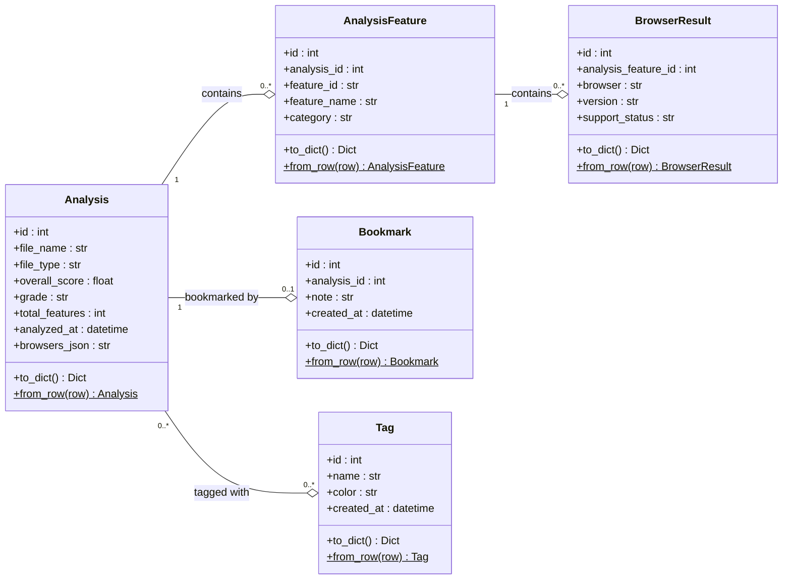

# 3.5 UML Diagram

```mermaid
classDiagram
    direction TB

    %% ─────────────────────────────────────────────
    %%  API FACADE
    %% ─────────────────────────────────────────────

    class AnalyzerService {
        <<facade>>
        -_analyzer : CrossGuardAnalyzer
        -_database_updater : DatabaseUpdater
        -_config : Dict
        +DEFAULT_BROWSERS : Dict

        +analyze(request: AnalysisRequest) AnalysisResult
        +analyze_files(html, css, js, browsers) AnalysisResult
        +save_analysis_to_history(result, file_name) int
        +get_analysis_history(limit, offset) List
        +get_statistics() Dict
        +export_to_json(analysis_id_or_result) str
        +export_to_pdf(analysis_id_or_result) str
        +get_ai_fix_suggestions(features, file_type) List
        +get_polyfill_suggestions(features) List
        +update_database(callback) DatabaseUpdateResult
        +get_custom_rules() Dict
        +save_custom_rules(rules_data) bool
    }

    %% ─────────────────────────────────────────────
    %%  ANALYZER / ORCHESTRATOR
    %% ─────────────────────────────────────────────

    class CrossGuardAnalyzer {
        +html_parser : HTMLParser
        +css_parser : CSSParser
        +js_parser : JavaScriptParser
        +database : CanIUseDatabase
        +compatibility_analyzer : CompatibilityAnalyzer
        +scorer : CompatibilityScorer
        +all_features : Set~str~

        +run_analysis(html_files, css_files, js_files, browsers) Dict
        +analyze_single_file(filepath, file_type, browsers) Dict
        +export_report(report, output_file, format) None
    }

    %% ─────────────────────────────────────────────
    %%  PARSERS
    %% ─────────────────────────────────────────────

    class HTMLParser {
        +features_found : Set~str~
        +feature_details : List~Dict~
        +unrecognized_patterns : Set~str~

        +parse_file(filepath: str) Set~str~
        +parse_string(html_content: str) Set~str~
        +get_detailed_report() Dict
        +get_statistics() Dict
        +validate_html(content: str) bool
    }

    class CSSParser {
        +features_found : Set~str~
        +feature_details : List~Dict~
        +unrecognized_patterns : Set~str~

        +parse_file(filepath: str) Set~str~
        +parse_string(css_content: str) Set~str~
        +get_detailed_report() Dict
        +get_statistics() Dict
        +validate_css(content: str) bool
    }

    class JavaScriptParser {
        +features_found : Set~str~
        +feature_details : List~Dict~
        +unrecognized_patterns : Set~str~

        +parse_file(filepath: str) Set~str~
        +parse_string(js_content: str) Set~str~
        +get_detailed_report() Dict
        +get_statistics() Dict
        +validate_javascript(content: str) bool
    }

    class CustomRulesLoader {
        <<singleton>>
        -_css_rules : Dict
        -_js_rules : Dict
        -_html_rules : Dict

        +get_custom_css_rules() Dict
        +get_custom_js_rules() Dict
        +get_custom_html_rules() Dict
        +reload() None
    }

    %% ─────────────────────────────────────────────
    %%  COMPATIBILITY ENGINE
    %% ─────────────────────────────────────────────

    class CompatibilityAnalyzer {
        +database : CanIUseDatabase

        +analyze(features, browsers) CompatibilityReport
        +analyze_feature(feature_id, browsers) CompatibilityIssue
        +get_detailed_issues(features, browsers) List
        +suggest_workarounds(issue) List~str~
    }

    class CanIUseDatabase {
        <<singleton>>
        +features : Dict
        +loaded : bool

        +load() bool
        +check_support(feature_id, browser, version) str
        +search_features(query: str) List~str~
        +get_feature_info(feature_id: str) Dict
        +get_browser_versions(browser: str) List~str~
    }

    class CompatibilityScorer {
        +browser_weights : Dict~str, float~
        +STATUS_SCORES : Dict~str, int~

        +calculate_simple_score(support_status) float
        +calculate_weighted_score(support_status) WeightedScore
        +calculate_compatibility_index(support_status) Dict
    }

    class DatabaseUpdater {
        +caniuse_dir : Path

        +update_database(callback) Dict
        +check_npm_update() Dict
        +get_database_info() Dict
    }

    %% ─────────────────────────────────────────────
    %%  DATABASE LAYER
    %% ─────────────────────────────────────────────

    class AnalysisRepository {
        -_conn : Connection

        +save_analysis(analysis: Analysis) int
        +get_all_analyses(limit, offset) List~Analysis~
        +get_analysis_by_id(id) Analysis
        +delete_analysis(id) bool
        +clear_all() int
    }

    class StatisticsService {
        -_conn : Connection

        +get_average_score() float
        +get_score_trend(days) List~Dict~
        +get_top_problematic_features(limit) List~Dict~
        +get_summary_statistics() Dict
    }

    %% ─────────────────────────────────────────────
    %%  AI & POLYFILL
    %% ─────────────────────────────────────────────

    class AIFixService {
        -_api_key : str
        -_provider : str
        -_model : str

        +is_available() bool
        +get_fix_suggestions(features, file_type, browsers) List
    }

    class PolyfillService {
        -_loader : PolyfillLoader

        +get_recommendations(unsupported, partial, browsers) List
        +get_aggregate_install_command(recs) str
        +get_total_size_kb(recs) float
    }

    %% ─────────────────────────────────────────────
    %%  CONFIG
    %% ─────────────────────────────────────────────

    class ConfigManager {
        -_config : Dict
        -_config_path : Path

        +browsers() Dict~str, str~
        +output_format() str
        +rules_path() str
        +get(key, default) Any
        +create_default_config(dir)$ str
    }

    %% ─────────────────────────────────────────────
    %%  GUI
    %% ─────────────────────────────────────────────

    class MainWindow {
        +current_report : Dict
        +export_manager : ExportManager
        -_analyzer_service : AnalyzerService
        +sidebar : Sidebar
        +header : HeaderBar
        +status_bar : StatusBar

        -_run_analysis() None
        -_build_results_view() None
        -_build_history_view() None
    }

    class ExportManager {
        +export(report, format, path) bool
        +export_json(report, path) str
        +export_pdf(report, path) str
        +export_sarif(report, path) str
        +export_csv(report, path) str
    }

    %% ─────────────────────────────────────────────
    %%  EXTERNAL SYSTEMS
    %% ─────────────────────────────────────────────

    class SQLite_DB {
        <<database>>
        crossguard.db
    }

    class CanIUse_Data {
        <<database>>
        data/caniuse/
    }

    class LLM_APIs {
        <<external>>
        OpenAI / Anthropic
    }

    %% ─────────────────────────────────────────────
    %%  RELATIONSHIPS
    %% ─────────────────────────────────────────────

    %% Frontend -> Facade
    MainWindow ..> AnalyzerService : Uses
    MainWindow *-- ExportManager

    %% Facade -> Backend
    AnalyzerService ..> CrossGuardAnalyzer : Creates
    AnalyzerService ..> DatabaseUpdater : Creates
    AnalyzerService ..> AnalysisRepository : Uses
    AnalyzerService ..> StatisticsService : Uses
    AnalyzerService ..> AIFixService : Uses
    AnalyzerService ..> PolyfillService : Uses
    AnalyzerService ..> ConfigManager : Uses

    %% Orchestrator -> Parsers
    CrossGuardAnalyzer *-- HTMLParser
    CrossGuardAnalyzer *-- CSSParser
    CrossGuardAnalyzer *-- JavaScriptParser
    CrossGuardAnalyzer *-- CompatibilityAnalyzer
    CrossGuardAnalyzer *-- CompatibilityScorer
    CrossGuardAnalyzer ..> CanIUseDatabase : Uses

    %% Parsers -> Rules
    HTMLParser ..> CustomRulesLoader : Loads rules
    CSSParser ..> CustomRulesLoader : Loads rules
    JavaScriptParser ..> CustomRulesLoader : Loads rules

    %% Compatibility Engine
    CompatibilityAnalyzer ..> CanIUseDatabase : Queries

    %% External systems
    CanIUseDatabase ..> CanIUse_Data : Reads
    DatabaseUpdater ..> CanIUse_Data : Updates
    AIFixService ..> LLM_APIs : Calls
    AnalysisRepository ..> SQLite_DB : Stored in
    StatisticsService ..> SQLite_DB : Queries
```

## Database Entity Relationships

```mermaid
classDiagram
    direction LR

    class Analysis {
        +id : int
        +file_name : str
        +file_type : str
        +overall_score : float
        +grade : str
        +total_features : int
        +analyzed_at : datetime
        +browsers_json : str

        +to_dict() Dict
        +from_row(row)$ Analysis
    }

    class AnalysisFeature {
        +id : int
        +analysis_id : int
        +feature_id : str
        +feature_name : str
        +category : str

        +to_dict() Dict
        +from_row(row)$ AnalysisFeature
    }

    class BrowserResult {
        +id : int
        +analysis_feature_id : int
        +browser : str
        +version : str
        +support_status : str

        +to_dict() Dict
        +from_row(row)$ BrowserResult
    }

    class Bookmark {
        +id : int
        +analysis_id : int
        +note : str
        +created_at : datetime

        +to_dict() Dict
        +from_row(row)$ Bookmark
    }

    class Tag {
        +id : int
        +name : str
        +color : str
        +created_at : datetime

        +to_dict() Dict
        +from_row(row)$ Tag
    }

    Analysis "1" --o "0..*" AnalysisFeature : contains
    AnalysisFeature "1" --o "0..*" BrowserResult : contains
    Analysis "1" --o "0..1" Bookmark : bookmarked by
    Analysis "0..*" --o "0..*" Tag : tagged with
```
